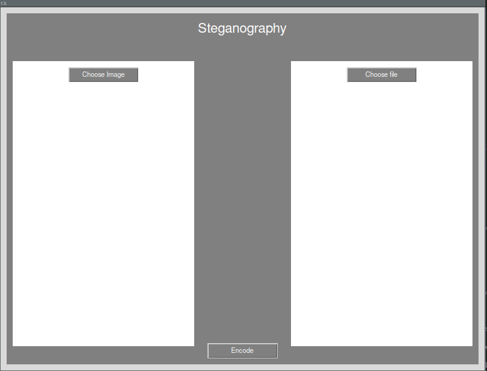
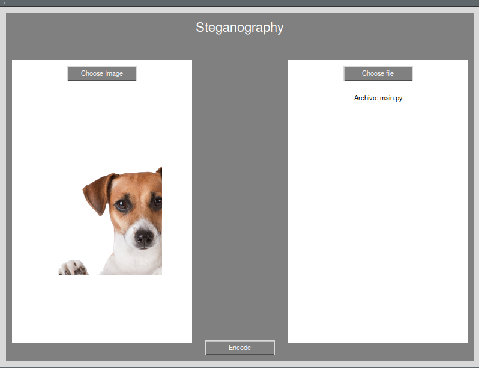
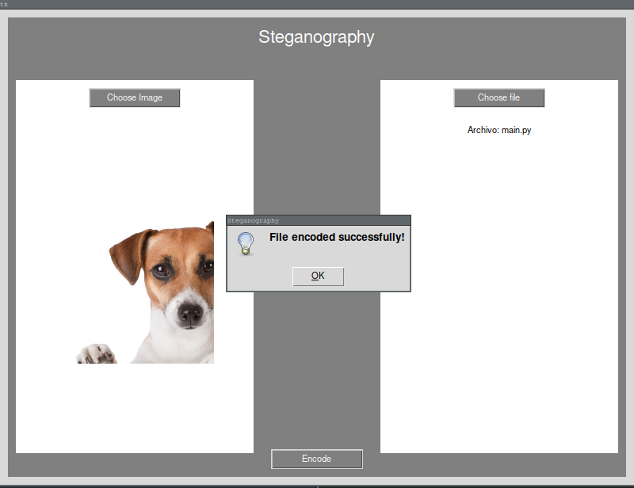

# STEGANOGRAPHY

## Instalación

Para instalar las dependencias, visita [este enlace](https://github.com/astral-sh/uv).

Una vez instalado, ejecuta los siguientes comandos desde el directorio principal:

```bash
uv sync
uv run main.py
```

## Interfaz

La interfaz es sencilla. Debes seleccionar una imagen en el lado izquierdo y un archivo en el lado derecho.



Después de seleccionar tanto la imagen como el archivo, haz clic en **Encode**. Dependiendo del tamaño del archivo que deseas ocultar, el proceso puede tardar más o menos. Ten en cuenta que si el archivo a ocultar es mayor que la imagen, el proceso fallará.



Si todo ha ido correctamente, verás una interfaz similar a la siguiente:



Al finalizar, encontrarás la imagen resultante con el mensaje oculto en la carpeta llamada `outputs`.


## Decode function
Seleccionando un archivo de tus outputs, o archivos que contengan un contenido oculto, al seleccionarlo este te devolverá un mensaje y en 
la carpeta decoders si ha ido tood bien tendrás tu archivo decodificado

## Tareas

- [X] Implementar la función `decode`.
- [ ] Añadir una notificación de "Cargando".
- [ ] Gestionar errores cuando la imagen es demasiado pequeña.
- [ ] Guardar información sobre el tipo de archivo oculto para poder reconstruirlo correctamente al decodificar.

